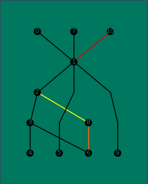

# NETWORK/ GRAPH LAYOUT
*********************************************************************************************************************
*********************************************************************************************************************
### Author		                :Bhekimpilo Ndhlela
### Name of Project           :Network/ Graph Layout
*********************************************************************************************************************
*********************************************************************************************************************

## Graphical User Interface Example:

### Text File Format

     0 -> 1
 
     1 -> 2
 
     2 -> 3
 
     3 -> 4
 
     7 -> 1
 
     1 -> 5
 
     3 -> 6
 
     2 -> 8
 
     2 -> 8
 
     1 -> 9
 
     10 -> 1
 
     10 -> 1
 
     10 -> 1
  
     10 -> 1

     8 -> 6

     8 -> 6

     8 -> 6

     NOTE: Some of the edges are repeated because i wanted to illustrate the coloring of the edges that occur the most.
     This is specified or briefly explained at the "What Happens:" Section, the last paragraph.
	
### Output Image of the Above Graph:

 

## Dependancies	:

Graph/ Network Layout depends on classes written by me(Bhekimpilo Ndhlela) which include:

       Layout.java (main/client library)

       GraphDummyNode.java

       GraphInitializer.java

       GraphNodeOrdering.java

       GraphOutput.java

       GraphRanking.java
       
       LayoutUnitTester.java(for coverage testing purposes)

It also depends on the sorting algorithms libraries from Princeton University, I rewrote some of them and edited most of them these algorithms include:

       Merge.java(inplace sorting algorithm for the BaryCenter method)

       AcyclicLP.java

       Bag.java

       DepthFirstOrder.java
 
       Digraph.java

       DirectedCycle.java

       DirectedEdge.java

       Queue.java
       
       Stack.java

       StdDraw.java

       Topological.java
       
  
## How and What To Compile:
Compilation	: javac Layout.java

Ignore The Following notes and execute.

     Note: Some input files use unchecked or unsafe operations.

     Note: Recompile with -Xlint:unchecked for details.

Execution: java Layout "Path of your desired graph"
       
     For Example: java ImageSort ~/LocalRepo/testCases/SpecGraph.txt

    
## What Happens(Briefly):

     The Algorithm has four major components. After having read the input file and creating the nodes and edges, it first ranks the nodes into different
     levels (Smin, Smax, S0, S1, ..., Sk). Secondly, it adds dummy nodes to the graph where edges stretch over rank sets. Thirdly, it orders the nodes 
     inside each level to minimize edge crossings. The last step is to find coordinate positions for each node and spline control points to draw all the
     edges between the nodes.

     Consider each rank set Si. For every node v in Si, consider its adjacent nodes w (in other ranked sets). If v is more than one rank away from any w,
     create a virtual (dummy) node t in rank set Si+1, and add a chain of virtual edges and nodes v-t0, t0-t1,..., tk-w, stepping through rank sets that
     are one rank apart.

     Draw the edges as straight lines, with bends at the virtual nodes. Do not draw the virtual nodes. Finally, edges are to be colourcoded to indicate 
     that they occur often (or not, if they occur only a few times). That is, you have to keep count of how often every edge occurs in the graph, and then
     colour the edges that occur the most red, the edges that occur second-most orange, and the edges that occur third-most dark yellow (make sure that the
     yellow is dark enough to be clearly visible on the screen). All other edges are to be drawn in black. For example, suppose there are five parallel
     edges between nodes 1 and 2, four edges between nodes 2 and 3, three edges between 1 and 3, and all other edges occur only once. Then you have to draw
     a single edge between 1 and 2, but colour it red, one edge coloured orange between 2 and 3, and one edge coloured dark yellow between 1 and 3. All other
     edges will be black.

